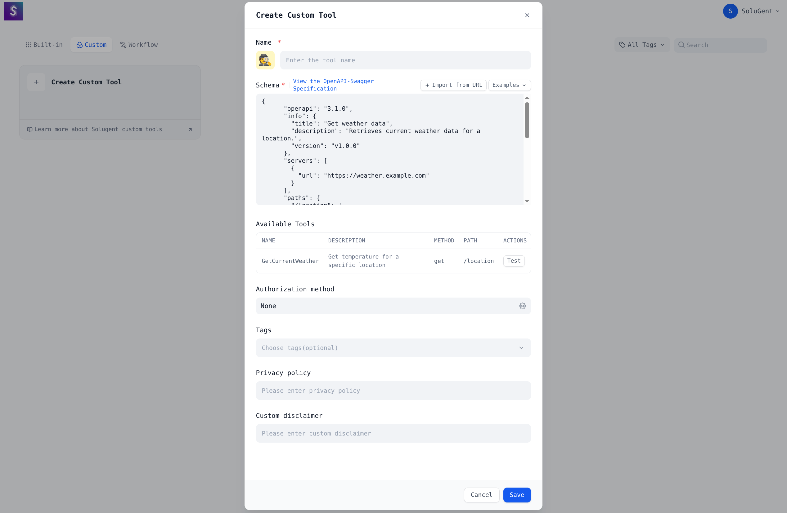

Our Official Website: [SoluGent](https://www.solugent.com)
Don't trust any other website that claims to be us.

SoluGent is an open-source LLM app development platform. Its intuitive interface combines agentic AI workflow, RAG pipeline, agent capabilities, model management, observability features and more, letting you quickly go from prototype to production.

## Quick start
> Before installing SoluGent, make sure your machine meets the following minimum system requirements:
> 
>- CPU >= 2 Core
>- RAM >= 4 GiB

</br>

The easiest way to start the SoluGent server is through [docker compose](docker/docker-compose.yaml). Before running SoluGent with the following commands, make sure that [Docker](https://docs.docker.com/get-docker/) and [Docker Compose](https://docs.docker.com/compose/install/) are installed on your machine:

```bash
cd solugent
cd docker
cp .env.example .env
docker compose up -d
```

After running, you can access the SoluGent dashboard in your browser at [http://localhost/install](http://localhost/install) and start the initialization process.

## Key features
**1. Workflow**: 
  Build and test powerful AI workflows on a visual canvas, leveraging all the following features and beyond. Look at the picture below to see how easy it is to create a solana RPC workflow in SoluGent.
  


**3. Prompt IDE**: 
  Intuitive interface for crafting prompts, comparing model performance, and adding additional features such as text-to-speech to a chat-based app. 

**4. RAG Pipeline**: 
  Extensive RAG capabilities that cover everything from document ingestion to retrieval, with out-of-box support for text extraction from PDFs, PPTs, and other common document formats.

**5. Agent capabilities**: 
  You can define agents based on LLM Function Calling or ReAct, and add pre-built or custom tools for the agent. Solugent provides 50+ built-in tools for AI agents, such as Google Search, DALL·E, Stable Diffusion and WolframAlpha.

**6. Custom Tools**:
  You can create custom tools for your agents easily.
  

## Using SoluGent

- **Cloud </br>**
We host a [SoluGent Online](https://www.solugent.com) service for anyone to try with zero setup. But we disabled registration for now, please contact us at [SoluGent](email:solugent@proton.me) to get an account.

- **Self-hosting</br>**
Quickly get SoluGent running in your environment with this [starter guide](#quick-start).


## Advanced Setup

If you need to customize the configuration, please refer to the comments in our [.env.example](docker/.env.example) file and update the corresponding values in your `.env` file. Additionally, you might need to make adjustments to the `docker-compose.yaml` file itself, such as changing image versions, port mappings, or volume mounts, based on your specific deployment environment and requirements. After making any changes, please re-run `docker-compose up -d`.